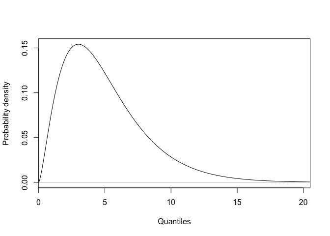
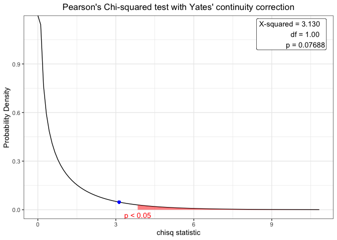

Graphiques associés aux distributions courantes en biologie
================

## Préambule

Ce projet a pour objectif de centraliser une réflexion lié aux
graphiques associées aux distributions courantes en biologie
(<http://biodatascience-course.sciviews.org/sdd-umons/lois-de-distributions.html>)

## Contexte

Après quelques recherches, j’ai trouvé des instructions comme présentée
ci-dessous. Il faut donc un peu moins de 10 lignes de codes afin de
produire la graphique de la distribution du chi<sup>2</sup>.

``` r
# Chi-square distribution (density probability) with parameter:
.df <- 5 # Degree of freedom .df
.col <- 1; .add <- FALSE # Plot parameters
.x <- seq(0, qchisq(0.999, df = .df), l = 1000)  # Quantiles
.d <- function (x) dchisq(x, df = .df)           # Distribution function
.q <- function (p) qchisq(p, df = .df)           # Quantile for lower-tail prob
.label <- bquote(paste(chi^2,(.(.df))))          # Curve parameters
curve(.d(x), xlim = range(.x), xaxs = "i", n = 1000, col = .col,
  add = .add, xlab = "Quantiles", ylab = "Probability density") # Curve
abline(h = 0, col = "gray") # Baseline
```

<!-- -->

Ensuite, j’ai trouvé le package
[webr](https://cardiomoon.github.io/webr/index.html) qui permet de
représenter le graphique associé à la distribution lié à un test
statistique.

Voici un exemple proposé dans la vigentte de ce
package.

``` r
# Ce package n'est pas dans la machine virtuelle mais il peut être facillement installé avec l'instruction suivante
#install.packages("webr")
#
require(moonBook)
```

    ## Loading required package: moonBook

``` r
require(webr)
```

    ## Loading required package: webr

``` r
 # chi-squared test
 x <- chisq.test(table(acs$sex, acs$DM))
 x
```

    ## 
    ##  Pearson's Chi-squared test with Yates' continuity correction
    ## 
    ## data:  table(acs$sex, acs$DM)
    ## X-squared = 3.1296, df = 1, p-value = 0.07688

``` r
 plot(x)
```

<!-- -->

La problématique avec ce package est que la réalisation du graphique de
la distribution n’est disponible que pour l’objet htest dans le cas cité
ci-dessus.

Je souhaiterai avoir à ma disposition un outil qui permet de réaliser
les graphiques de distributions en précisant par exemple uniquement la
distribution, le nombre de degré de liberté,…

La suite de la réflexion se trouve dans le dossier notebook de ce
projet.

## Réflexion

``` r
dir_tree(path = "notebook")
```

    ## notebook
    ## ├── 01_pdp.Rmd
    ## ├── 01_pdp.md
    ## ├── 01_pdp_files
    ## │   └── figure-gfm
    ## │       ├── unnamed-chunk-1-1.png
    ## │       ├── unnamed-chunk-10-1.png
    ## │       ├── unnamed-chunk-11-1.png
    ## │       ├── unnamed-chunk-11-2.png
    ## │       ├── unnamed-chunk-12-1.png
    ## │       ├── unnamed-chunk-12-2.png
    ## │       ├── unnamed-chunk-12-3.png
    ## │       ├── unnamed-chunk-13-1.png
    ## │       ├── unnamed-chunk-13-2.png
    ## │       ├── unnamed-chunk-13-3.png
    ## │       ├── unnamed-chunk-2-1.png
    ## │       ├── unnamed-chunk-3-1.png
    ## │       ├── unnamed-chunk-3-2.png
    ## │       ├── unnamed-chunk-3-3.png
    ## │       ├── unnamed-chunk-3-4.png
    ## │       ├── unnamed-chunk-4-1.png
    ## │       ├── unnamed-chunk-4-2.png
    ## │       ├── unnamed-chunk-4-3.png
    ## │       ├── unnamed-chunk-4-4.png
    ## │       ├── unnamed-chunk-4-5.png
    ## │       ├── unnamed-chunk-6-1.png
    ## │       ├── unnamed-chunk-6-2.png
    ## │       ├── unnamed-chunk-6-3.png
    ## │       ├── unnamed-chunk-6-4.png
    ## │       ├── unnamed-chunk-8-1.png
    ## │       └── unnamed-chunk-9-1.png
    ## ├── 02_pdp.Rmd
    ## └── 03_pdp.Rmd

### 01\_pdp.Rmd

Ce fichier contient un premier tour d’horizon de la problématique ainsi
que les quelques propositions de solutions.

Ce début de projet est présenté lors de la réunion du **16 janvier
2020** dans le cadre des séminaires du service d’Ecologie Numérique des
Milieux Aquatiques (ECONUM).

### 02\_pdp.Rmd

Suite à la réunion du **16 janvier 2020**, il est décidé de s’orienter
vers les objet **R6** pour résoudre cette problématique.

Ce document tente de comprendre et de maitriser les objet R6 dans R.

### 03\_pdp.Rmd

Suite aux recherches effectuées sur les R6 OOP, le package **distr6**
est trouvé. Il propose des outils assez similaire à ce que l’on souhaite
réaliser.

La fonction plot() propose de réaliser des graphiques en R de base pour
visualiser chaque distribution.

## Note


Ce dépôt rentre dans le cadre des recherches liées à l’organisation
SciViews.

Pour en apprendre plus, visitez
<http://www.sciviews.org>

-----


Ce dépôt rentre dans le cadre des recherches liées aux cours de sciences
des données biologique de l’UMONS.

Pour en apprendre plus, visitez
<https://github.com/BioDataScience-Course>

-----
