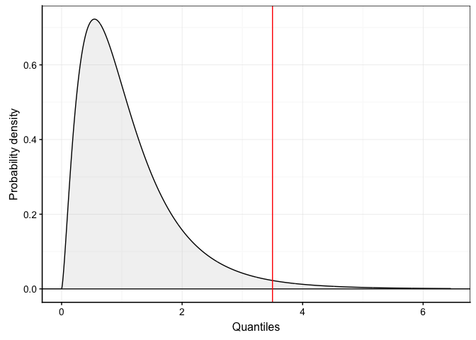

density\_plot()
================

Ce projet a été présenté le **16 janvier 2020** dans le cadre des
séminaires du service d’Ecologie Numérique des Milieux Aquatiques
(ECONUM).

A la suite de la discussion concernant ce projet, les propositons
suivantes ont été mises en avant :

  - l’idée est intéressante et mérite d’y consacrer du temps.
  - les fonctions réalisée seront placé dans un nouveau package de
    l’univers SciViews nommé : `infer.tool`. Ce package aura pour
    objectif de fournir des outils afin de réaliser des tests
    d’inférence dans R
  - Il est proposé d’explorer les R6 OOP pour ce projet.
  - Il a été mis en évidence de l’importance d’employer des arguments
    employé par les fonctions de R de base comme par exemple df pour les
    degrés de liberté et non degrees of freedom,…

## Préambule

Ce document est réalisé afin de permettre la réfléxion sur l’écriture
d’une/des fonctions concernant la problématique des graphiques
associés aux distributions statistiques.

En effet, il n’existe pas à ma connaissance de fonction permettant de
réaliser simplement le graphique associé à une distribution
statistique. Ce type de graphique peut par exemple être utile lors de
l’apprentissage des tests d’inférences.

## Contexte

Après quelques recherches, j’ai trouvé des instructions comme présentée
ci-dessous. Il faut donc un peu moins de 10 lignes de codes afin de
produire la graphique de la distribution du chi<sup>2</sup>.

``` r
# Chi-square distribution (density probability) with parameter:
.df <- 5 # Degree of freedom .df
.col <- 1; .add <- FALSE # Plot parameters
.x <- seq(0, qchisq(0.999, df = .df), l = 1000)  # Quantiles
.d <- function (x) dchisq(x, df = .df)           # Distribution function
.q <- function (p) qchisq(p, df = .df)           # Quantile for lower-tail prob
.label <- bquote(paste(chi^2,(.(.df))))          # Curve parameters
curve(.d(x), xlim = range(.x), xaxs = "i", n = 1000, col = .col,
  add = .add, xlab = "Quantiles", ylab = "Probability density") # Curve
abline(h = 0, col = "gray") # Baseline
```

<!-- -->

Ensuite, j’ai trouvé le package
[webr](https://cardiomoon.github.io/webr/index.html) qui permet de
représenter le graphique associé à la distribution lié à un test
statistique.

Voici un exemple proposé dans la vigentte de ce
package.

``` r
# Ce package n'est pas dans la machine virtuelle mais il peut être facillement installé avec l'instruction suivante
#install.packages("webr")
#
require(moonBook)
```

    ## Loading required package: moonBook

``` r
require(webr)
```

    ## Loading required package: webr

``` r
 # chi-squared test
 x <- chisq.test(table(acs$sex, acs$DM))
 x
```

    ## 
    ##  Pearson's Chi-squared test with Yates' continuity correction
    ## 
    ## data:  table(acs$sex, acs$DM)
    ## X-squared = 3.1296, df = 1, p-value = 0.07688

``` r
 plot(x)
```

<!-- -->

La problématique avec ce package est que la réalisation du graphique de
la distribution n’est disponible que pour l’objet htest dans le cas cité
ci-dessus.

Je souhaiterai avoir à ma disposition un outil qui permet de réaliser
les graphiques de distributions en précisant par exemple uniquement la
distribution, le nombre de degré de liberté,…

à la suite de ce constant je propose un début de réflexion ci-dessous.

## Distribution du chi<sup>2</sup>

``` r
source("../R/plot_chisq.R")
plot_chisq
```

    ## function (df, quantiles = NULL, seuil_alpha = NULL, xlab = "Quantiles", 
    ##     ylab = "Probability density", ...) 
    ## {
    ##     .x <- seq(0, qchisq(0.9999, df = df), l = 1000)
    ##     .d <- function(x) dchisq(x, df = df)
    ##     .q <- function(p) qchisq(p, df = df)
    ##     a <- chart::chart(data = tibble::tibble(quantiles = .x, prob = .d(.x)), 
    ##         prob ~ quantiles) + ggplot2::geom_hline(yintercept = 0, 
    ##         col = "Black") + ggplot2::geom_ribbon(ggplot2::aes(x = .x, 
    ##         ymin = 0, ymax = .d(.x)), fill = "gray", alpha = 0.2) + 
    ##         ggplot2::geom_line() + ggplot2::labs(x = xlab, y = ylab, 
    ##         ...)
    ##     if (!is.null(quantiles)) {
    ##         a <- a + ggplot2::geom_vline(xintercept = quantiles, 
    ##             col = "Red")
    ##     }
    ##     if (!is.null(seuil_alpha)) {
    ##         q_ref <- qchisq(seuil_alpha, df = df, lower.tail = FALSE)
    ##         .x2 <- .x
    ##         .x2[.x2 < q_ref] <- NA
    ##         a <- a + ggplot2::geom_ribbon(ggplot2::aes(x = .x2, ymin = 0, 
    ##             ymax = .d(.x2)), fill = "red", alpha = 0.2)
    ##     }
    ##     a
    ## }

``` r
plot_chisq(df = 1)
```

<!-- -->

``` r
plot_chisq(df = 3, seuil_alpha = 0.05)
```

<!-- -->

``` r
plot_chisq(df = 10, quantiles = 34)
```

<!-- -->

``` r
plot_chisq(df = 3, seuil_alpha = 0.05, quantiles = 34)
```

<!-- -->

## Distribution de Student

``` r
source("../R/plot_t.R")
plot_t
```

    ## function (mu = 0, sigma = 1, df, quantiles = NULL, seuil_alpha = NULL, 
    ##     alternative = c("two.sided", "less", "greater"), xlab = "Quantiles", 
    ##     ylab = "Probability density", ...) 
    ## {
    ##     .x <- seq(-4.5 * sigma + mu, 4.5 * sigma + mu, l = 1000)
    ##     .d <- function(x) dt((x - mu)/sigma, df = df)/sigma
    ##     .q <- function(p) qt(p, df = df) * sigma + mu
    ##     a <- chart::chart(data = tibble::tibble(quantiles = .x, prob = .d(.x)), 
    ##         prob ~ quantiles) + ggplot2::geom_hline(yintercept = 0, 
    ##         col = "Black") + ggplot2::geom_ribbon(ggplot2::aes(x = .x, 
    ##         ymin = 0, ymax = .d(.x)), fill = "gray", alpha = 0.2) + 
    ##         ggplot2::geom_line() + ggplot2::labs(x = xlab, y = ylab, 
    ##         ...)
    ##     if (!is.null(quantiles)) {
    ##         a <- a + ggplot2::geom_vline(xintercept = quantiles, 
    ##             col = "Red")
    ##     }
    ##     if (!is.null(seuil_alpha)) {
    ##         if (isTRUE(alternative == "two.sided")) {
    ##             alpha2 <- seuil_alpha/2
    ##             q_ref_left <- mu + sigma * qt(alpha2, df = df, lower.tail = TRUE)
    ##             q_ref_right <- mu + sigma * qt(alpha2, df = df, lower.tail = FALSE)
    ##             .x2 <- .x1 <- .x
    ##             .x1[.x1 > q_ref_left] <- NA
    ##             .x2[.x2 < q_ref_right] <- NA
    ##             a <- a + ggplot2::geom_ribbon(ggplot2::aes(x = .x1, 
    ##                 ymin = 0, ymax = .d(.x1)), fill = "red", alpha = 0.2) + 
    ##                 ggplot2::geom_ribbon(ggplot2::aes(x = .x2, ymin = 0, 
    ##                   ymax = .d(.x2)), fill = "red", alpha = 0.2)
    ##         }
    ##         if (isTRUE(alternative == "less")) {
    ##             q_ref_left <- mu + sigma * qt(seuil_alpha, df = df, 
    ##                 lower.tail = TRUE)
    ##             .x1 <- .x
    ##             .x1[.x1 > q_ref_left] <- NA
    ##             a <- a + ggplot2::geom_ribbon(ggplot2::aes(x = .x1, 
    ##                 ymin = 0, ymax = .d(.x1)), fill = "red", alpha = 0.2)
    ##         }
    ##         if (isTRUE(alternative == "greater")) {
    ##             q_ref_right <- mu + sigma * qt(seuil_alpha, df = df, 
    ##                 lower.tail = FALSE)
    ##             .x2 <- .x
    ##             .x2[.x2 < q_ref_right] <- NA
    ##             a <- a + ggplot2::geom_ribbon(ggplot2::aes(x = .x2, 
    ##                 ymin = 0, ymax = .d(.x2)), fill = "red", alpha = 0.2)
    ##         }
    ##     }
    ##     a
    ## }

``` r
plot_t(mu = 10, sigma = 6, df = 500)
```

<!-- -->

``` r
plot_t(mu = 10, sigma = 1, df = 500, quantiles = 12)
```

<!-- -->

``` r
plot_t(mu = 10, sigma = 1, df = 500, quantiles = 11, seuil_alpha = 0.05, alternative = "two.sided")
```

<!-- -->

``` r
plot_t(mu = 10, sigma = 1, df = 500, quantiles = 11, seuil_alpha = 0.05, alternative = "less")
```

<!-- -->

``` r
plot_t(mu = 10, sigma = 1, df = 500, quantiles = 11, seuil_alpha = 0.05, alternative = "greater")
```

<!-- -->

## Distribution F

``` r
source("../R/plot_f.R")
plot_f
```

    ## function (df1, df2, quantiles = NULL, seuil_alpha = NULL, xlab = "Quantiles", 
    ##     ylab = "Probability density", ...) 
    ## {
    ##     .x <- seq(0, qf(0.999, df1 = df1, df2 = df2), l = 1000)
    ##     .d <- function(x) df(x, df1 = df1, df2 = df2)
    ##     .q <- function(p) qf(p, df1 = df1, df2 = df2)
    ##     a <- chart::chart(data = tibble::tibble(quantiles = .x, prob = .d(.x)), 
    ##         prob ~ quantiles) + ggplot2::geom_hline(yintercept = 0, 
    ##         col = "Black") + ggplot2::geom_ribbon(ggplot2::aes(x = .x, 
    ##         ymin = 0, ymax = .d(.x)), fill = "gray", alpha = 0.2) + 
    ##         ggplot2::geom_line() + ggplot2::labs(x = xlab, y = ylab, 
    ##         ...)
    ##     if (!is.null(quantiles)) {
    ##         a <- a + ggplot2::geom_vline(xintercept = quantiles, 
    ##             col = "Red")
    ##     }
    ##     if (!is.null(seuil_alpha)) {
    ##         q_ref <- qf(seuil_alpha, df1 = df1, df2 = df2, lower.tail = FALSE)
    ##         .x2 <- .x
    ##         .x2[.x2 < q_ref] <- NA
    ##         a <- a + ggplot2::geom_ribbon(ggplot2::aes(x = .x2, ymin = 0, 
    ##             ymax = .d(.x2)), fill = "red", alpha = 0.2)
    ##     }
    ##     a
    ## }

``` r
plot_f(df1 = 5, df2 = 20)
```

<!-- -->

``` r
plot_f(df1 = 5, df2 = 20, seuil_alpha = 0.05)
```

<!-- -->

``` r
plot_f(df1 = 5, df2 = 20, quantiles = 3.5)
```

<!-- -->

``` r
plot_f(df1 = 5, df2 = 20, 
  quantiles = 3.5, seuil_alpha = 0.05)
```

<!-- -->

## Fonction autoplot() pour le chisq.test()

``` r
source("../R/autoplot.htest.R")
autoplot.htest
```

    ## function (object) 
    ## {
    ##     if (attr(object$statistic, which = "names") == "X-squared") {
    ##         a <- plot_chisq(df = object$parameter, seuil_alpha = 0.05, 
    ##             quantiles = object$statistic)
    ##     }
    ##     if (attr(object$statistic, which = "names") == "t") {
    ##         a <- plot_t(mu = 0, sigma = 1, df = object$parameter, 
    ##             quantiles = object$statistic, seuil_alpha = (1 - 
    ##                 attr(object$conf.int, "conf.level")), alternative = object$alternative)
    ##     }
    ##     a
    ## }

## test

### chisq.test

``` r
crossbill <- tibble::tibble(cb = c(rep("left", 1895), rep("right", 1752)))

(crossbill_tab <- table(crossbill$cb))
```

    ## 
    ##  left right 
    ##  1895  1752

``` r
ggplot2::autoplot(chisq.test(crossbill_tab, p = c(1/2, 1/2)))
```

<!-- -->

``` r
monkey <- tibble::tibble(food = c(rep("apple", 1895), rep("peer", 1752), rep("banana", 1812)))
(monkey_tab <- table(monkey$food))
```

    ## 
    ##  apple banana   peer 
    ##   1895   1812   1752

``` r
ggplot2::autoplot(chisq.test(monkey_tab, p = c(1/3, 1/3, 1/3)))
```

<!-- -->

``` r
timolol1 <- tibble::tibble(
  traitement = c("timolol", "timolol", "placebo", "placebo"),
  patient    = c("sain",    "malade",  "sain",    "malade"),
  freq       = c(44,        116,       19,        128)
)
# Création du tableau de contingence 
timolol_table <- xtabs(data = timolol1, freq ~ patient + traitement)
timolol_table
```

    ##         traitement
    ## patient  placebo timolol
    ##   malade     128     116
    ##   sain        19      44

``` r
(chi2. <- chisq.test(timolol_table)); cat("Expected frequencies:\n"); chi2.[["expected"]]
```

    ## 
    ##  Pearson's Chi-squared test with Yates' continuity correction
    ## 
    ## data:  timolol_table
    ## X-squared = 9.1046, df = 1, p-value = 0.00255

    ## Expected frequencies:

    ##         traitement
    ## patient    placebo   timolol
    ##   malade 116.83388 127.16612
    ##   sain    30.16612  32.83388

``` r
ggplot2::autoplot(chi2.)
```

<!-- -->

### t.test

``` r
is <- data.io::read("iris", package = "datasets", lang = "FR") %>.%
  dplyr::filter(. , species != "versicolor") %>.%
  dplyr::mutate(., species = droplevels(species)) -> species

t_test <- t.test(petal_length ~ species, is)
ggplot2::autoplot(t_test)
```

<!-- -->

``` r
t_test <- t.test(petal_length ~ species, is, alternative = "less")
ggplot2::autoplot(t_test)
```

<!-- -->

``` r
crabs <- data.io::read("crabs", package = "MASS", lang = "fr")

t_test <- t.test(data = crabs, rear ~ sex,
  alternative = "two.sided", conf.level = 0.95, var.equal = TRUE)
ggplot2::autoplot(t_test)
```

<!-- -->

``` r
t_test <- t.test(data = crabs, rear ~ sex,
  alternative = "two.sided", conf.level = 0.99, var.equal = TRUE)
ggplot2::autoplot(t_test)
```

<!-- -->

``` r
t_test  <- t.test(crabs$front, crabs$rear,
  alternative = "two.sided", conf.level = 0.95, paired = TRUE)
ggplot2::autoplot(t_test)
```

<!-- -->

``` r
sleep <- data.io::read("sleep", package = "datasets")

sleep2 <- tidyr::spread(sleep, key = group, value = extra)
names(sleep2) <- c("id", "med1", "med2")

t_test  <- t.test(sleep2$med1, sleep2$med2,
  alternative = "two.sided", conf.level = 0.95, paired = TRUE)

ggplot2::autoplot(t_test)
```

<!-- -->

``` r
t_test  <- t.test(sleep2$med1,
  alternative = "two.sided", mu = 0, conf.level = 0.95)

ggplot2::autoplot(t_test)
```

<!-- -->

``` r
t_test  <- t.test(sleep2$med1,
  alternative = "two.sided", mu = 1, conf.level = 0.95)

ggplot2::autoplot(t_test)
```

<!-- -->
