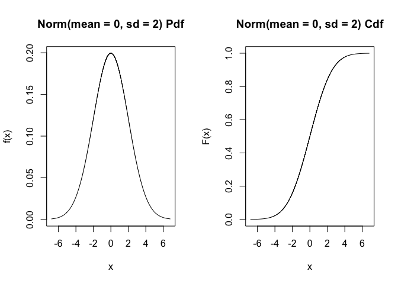
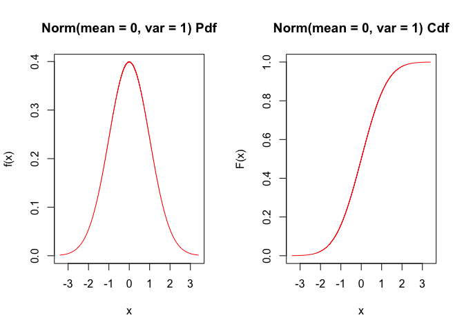
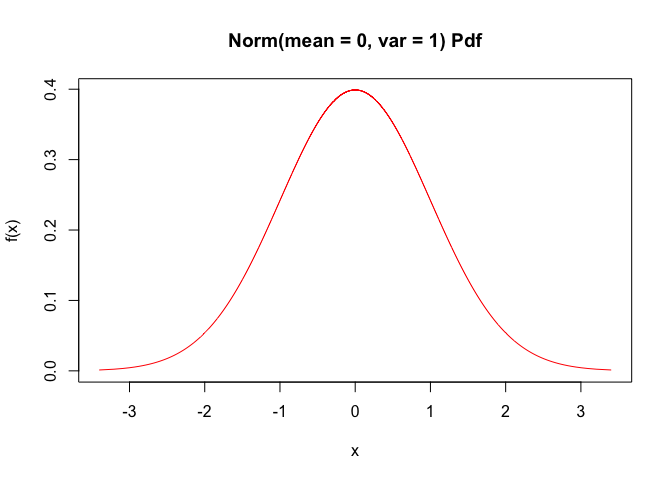
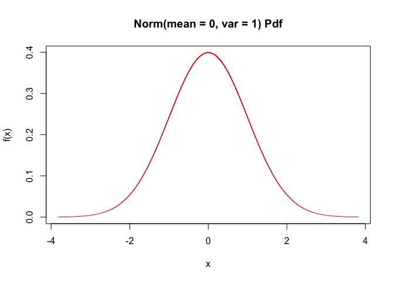

Le package distr6
================

A la suite de mes recherches sur les R6 OOP, j’ai découvert le package
distr6. Ce package n’est pas exécutable dans la configuration standard
de la SciViews Box 2019 (La suite de ce document est donc rédigé en
dehors de cette dernière).

Le package distr6 propose déjà une fonction plot afin de montrer \#\#
Initiation au package distr6

Ces quelques exemples montrent les bases de package distr6.

``` r
library(distr6)
```

    ## 
    ## -----------------------------

    ##  distr6 v1.3.2
    ## 
    ## Get started: ?distr6
    ## Changelog:   distr6News()

    ## -----------------------------

    ## 
    ## Attaching package: 'distr6'

    ## The following object is masked from 'package:stats':
    ## 
    ##     qqplot

    ## The following object is masked from 'package:grDevices':
    ## 
    ##     pdf

    ## The following objects are masked from 'package:base':
    ## 
    ##     mode, truncate

La distribution normale est employée afin de découvrir cet
outil.

``` r
# on cree un objet en lien avec une distribution normale de moyenne 0 et d'écart-type de 2
n <- Normal$new(mean = 0, sd = 2)
```

Un ensemble d’information sur notre objet nommé `n` avec les fonction

``` r
n$print()
```

    ## Norm(mean = 0, sd = 2)

``` r
n$summary()
```

    ## Normal Probability Distribution. Parameterised with:
    ##   mean = 0, sd = 2
    ## 
    ##   Quick Statistics 
    ##  Mean:       0
    ##  Variance:   4
    ##  Skewness:   0
    ##  Ex. Kurtosis:   0
    ## 
    ##  Support: ℝ  Scientific Type: ℝ 
    ## 
    ##  Traits: continuous; univariate
    ##  Properties: symmetric; mesokurtic; no skew

``` r
n$parameters()
```

    ##      id value support                                 description
    ## 1: mean     0       ℝ                   Mean - Location Parameter
    ## 2:  var     4      ℝ+          Variance - Squared Scale Parameter
    ## 3:   sd     2      ℝ+        Standard Deviation - Scale Parameter
    ## 4: prec  0.25      ℝ+ Precision - Inverse Squared Scale Parameter

Il est évidement possible de connaitre un des paramètres de la
distribution en particulier avec la fonction suivante

``` r
n$getParameterValue("prec")
```

    ## [1] 0.25

Pour modifier l’objet, on va employer la fonction suivante

``` r
n$setParameterValue(mean = 5, prec = 2)
# toutes les modifications sont visibles dans avec les fonctions citées précédement
#n$summary()
n$parameters()
```

    ##      id     value support                                 description
    ## 1: mean         5       ℝ                   Mean - Location Parameter
    ## 2:  var       0.5      ℝ+          Variance - Squared Scale Parameter
    ## 3:   sd 0.7071068      ℝ+        Standard Deviation - Scale Parameter
    ## 4: prec         2      ℝ+ Precision - Inverse Squared Scale Parameter

``` r
#n$properties()
```

## Statistiques courantes sur les distributions

Les fonctions comme dnorm(), pnorm(), qnorm(), rnorm() sont disponibles
avec quelques modifications des noms de fonction

``` r
n$setParameterValue(mean = 0, sd = 2)
# dnorm ----
## stats package
dnorm(x = 2, mean = 0, sd = 2)
```

    ## [1] 0.1209854

``` r
## distr6 package
## 
n$pdf(2)
```

    ## [1] 0.1209854

``` r
## ou 
pdf(n, 2)
```

    ## [1] 0.1209854

``` r
## ou encore
n %>% pdf(2)
```

    ## [1] 0.1209854

Les autres fonctions courantes sont présentée
    ci-dessous

``` r
pnorm(q = 2, mean = 0, sd = 2)
```

    ## [1] 0.8413447

``` r
n$cdf(2)
```

    ## [1] 0.8413447

``` r
pnorm(q = 2, mean = 0, sd = 2, lower.tail = F)
```

    ## [1] 0.1586553

``` r
n$cdf(2, lower.tail = F)
```

    ## [1] 0.1586553

``` r
rnorm(n = 10, mean = 0, sd = 2)
```

    ##  [1]  3.4999843  0.7268131  2.5516143  3.1291070 -2.1271747  1.1067719
    ##  [7]  1.1284180 -0.7358971  4.5440563  0.1275887

``` r
n$rand(10)
```

    ##  [1]  0.32941777 -2.10650788  2.27902570 -1.23958917 -0.89470179 -0.35958288
    ##  [7]  5.67333294 -1.55153249  0.03751662 -0.79419431

Après avoir regardé au fonction dans la package, il existe déjà un
fonction plot.distribution()

``` r
plot(n)
```

<!-- -->

``` r
plot(Normal$new(), col = "red")
```

<!-- -->

``` r
plot(Normal$new(), fun = "pdf",col = "red")
```

<!-- -->

``` r
plot(Normal$new(), fun = "pdf", npoints = 15000, col = "red")
```

<!-- -->

## Les distributions disponibles

Ce package est prévu pour travailler avec de nombreuses distribution
comme le montre la liste
    ci-dessous

``` r
listDistributions(simplify = FALSE, filter = NULL)
```

    ##      ShortName               ClassName    Type ValueSupport  VariateForm
    ##  1:        Arc                 Arcsine       ℝ   continuous   univariate
    ##  2:       Bern               Bernoulli      ℕ0     discrete   univariate
    ##  3:       Beta                    Beta      ℝ+   continuous   univariate
    ##  4:     BetaNC          BetaNoncentral      ℝ+   continuous   univariate
    ##  5:      Binom                Binomial      ℕ0     discrete   univariate
    ##  6:        Cat             Categorical       ℂ     discrete   univariate
    ##  7:     Cauchy                  Cauchy       ℝ   continuous   univariate
    ##  8:      ChiSq              ChiSquared      ℝ+   continuous   univariate
    ##  9:    ChiSqNC    ChiSquaredNoncentral      ℝ+   continuous   univariate
    ## 10:      Degen              Degenerate       ℝ     discrete   univariate
    ## 11:       Diri               Dirichlet [0,1]^K   continuous multivariate
    ## 12:      DUnif         DiscreteUniform       ℤ     discrete   univariate
    ## 13:        Emp               Empirical       ℝ     discrete   univariate
    ## 14:        Exp             Exponential      ℝ+   continuous   univariate
    ## 15:          F           FDistribution      ℝ+   continuous   univariate
    ## 16:        FNC FDistributionNoncentral      ℝ+   continuous   univariate
    ## 17:       Frec                 Frechet       ℝ   continuous   univariate
    ## 18:      Gamma                   Gamma      ℝ+   continuous   univariate
    ## 19:       Geom               Geometric      ℕ0     discrete   univariate
    ## 20:       Gomp                Gompertz      ℝ+   continuous   univariate
    ## 21:       Gumb                  Gumbel      ℝ+   continuous   univariate
    ## 22:      Hyper          Hypergeometric      ℕ0     discrete   univariate
    ## 23:     invgam            InverseGamma      ℝ+   continuous   univariate
    ## 24:        Lap                 Laplace       ℝ   continuous   univariate
    ## 25:        Log             Logarithmic      ℕ0     discrete   univariate
    ## 26:      Logis                Logistic       ℝ   continuous   univariate
    ## 27:     LLogis             Loglogistic      ℝ+   continuous   univariate
    ## 28:      Lnorm               Lognormal      ℝ+   continuous   univariate
    ## 29:   Multinom             Multinomial    ℕ0^K     discrete multivariate
    ## 30:  MultiNorm      MultivariateNormal     ℝ^K   continuous multivariate
    ## 31:     NBinom        NegativeBinomial      ℕ0     discrete   univariate
    ## 32:       Norm                  Normal       ℝ   continuous   univariate
    ## 33:       Pare                  Pareto      ℝ+   continuous   univariate
    ## 34:       Pois                 Poisson      ℕ0     discrete   univariate
    ## 35:       Rayl                Rayleigh      ℝ+   continuous   univariate
    ## 36:          T                StudentT       ℝ   continuous   univariate
    ## 37:        TNC      StudentTNoncentral       ℝ   continuous   univariate
    ## 38:        Tri              Triangular       ℝ   continuous   univariate
    ## 39:       Unif                 Uniform       ℝ   continuous   univariate
    ## 40:       Wald                    Wald      ℝ+   continuous   univariate
    ## 41:    Weibull                 Weibull      ℝ+   continuous   univariate
    ## 42: WeightDisc        WeightedDiscrete       ℝ     discrete   univariate
    ##      ShortName               ClassName    Type ValueSupport  VariateForm
    ##        Package
    ##  1:     distr6
    ##  2:      stats
    ##  3:      stats
    ##  4:      stats
    ##  5:      stats
    ##  6:     distr6
    ##  7:      stats
    ##  8:      stats
    ##  9:      stats
    ## 10:     distr6
    ## 11:     distr6
    ## 12:     distr6
    ## 13:     distr6
    ## 14:      stats
    ## 15:      stats
    ## 16:      stats
    ## 17:     distr6
    ## 18:      stats
    ## 19:      stats
    ## 20:     distr6
    ## 21:     distr6
    ## 22:      stats
    ## 23: extraDistr
    ## 24:     distr6
    ## 25: extraDistr
    ## 26:      stats
    ## 27:     distr6
    ## 28:      stats
    ## 29:      stats
    ## 30:     distr6
    ## 31:     distr6
    ## 32:      stats
    ## 33:     distr6
    ## 34:      stats
    ## 35:     distr6
    ## 36:      stats
    ## 37:      stats
    ## 38:     distr6
    ## 39:      stats
    ## 40:     distr6
    ## 41:      stats
    ## 42:     distr6
    ##        Package

## Pour en savoir plus

Une série de tutoriels avancées sont proposés via la lien suivant
:

<https://alan-turing-institute.github.io/distr6/articles/webs/s3_piping.html>
