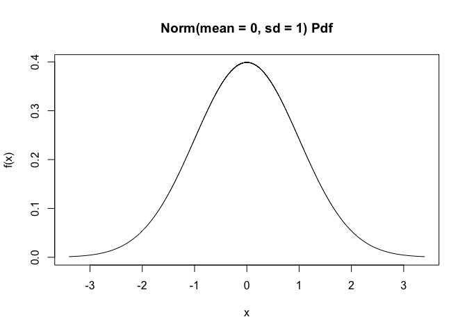
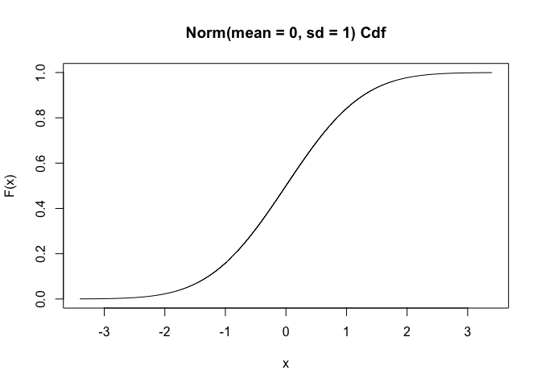

Snippets des distribution VS le package distr6
================

Afin d’aider les étudiants à visualiser et manipuler les distributions
courantes en biologie, des snippets sont mis à leur disposition. Pour la
distribution normale, les snippets sont les suivants :

``` r
# .in
## Distribution: normal #########################################################################
#snippet ..i (d)istribution: normal
    .in

#snippet .inrlabel: Normal dist. - add label to the right
    text(.mu+.s, .d(.mu+.s), .label, pos = 4, col = .col) # Label at right

#snippet .inllabel: Normal dist. - add label to the left
    text(.mu-.s, .d(.mu-.s), .label, pos = 2, col = .col) # Label at left

#snippet ..i (d)istribution: normal
    .in

#snippet .inrlabel: Normal dist. - add label to the right
    text(.mu+.s, .d(.mu+.s), .label, pos = 4, col = .col) # Label at right

#snippet .inllabel: Normal dist. - add label to the left
    text(.mu-.s, .d(.mu-.s), .label, pos = 2, col = .col) # Label at left

#snippet .incumul: Normal dist. - cumulative dens. plot
    # Normal distribution (cumulative probability) with parameters:
    .mu <- ${1:0}; .s <- ${2:1} #  mu = .mu and sigma = .s
    .col <- ${3:1}; .add <- ${4:FALSE} # Plot parameters
    .x <- seq(-3.5*.s+.mu, 3.5*.s+.mu, l = 1000)     # Quantiles
    .d <- function (x) pnorm(x, mean = .mu, sd = .s) # Density function
    .q <- function (p) qnorm(p, mean = .mu, sd = .s) # Quantile for lower-tail prob
    .label <- bquote(N(.(.mu), .(.s)))               # Curve parameters
    curve(.d(x), xlim = range(.x), ylim = 0:1, xaxs = "i", n = 1000, col = .col,
        add = .add, xlab = "Quantiles", ylab = "Cumulative probability") # Curve
    abline(h = 0:1, col = "gray") # Baseline

#snippet .indens: Normal dist. - density plot
    # Normal distribution (density probability) with parameters:
    .mu <- ${1:0}; .s <- ${2:1} #  mu = .mu and sigma = .s
    .col <- ${3:1}; .add <- ${4:FALSE} # Plot parameters
    .x <- seq(-3.5*.s+.mu, 3.5*.s+.mu, l = 1000)     # Quantiles
    .d <- function (x) dnorm(x, mean = .mu, sd = .s) # Distribution function
    .q <- function (p) qnorm(p, mean = .mu, sd = .s) # Quantile for lower-tail prob
    .label <- bquote(N(.(.mu), .(.s)))               # Curve parameters
    curve(.d(x), xlim = range(.x), xaxs = "i", n = 1000, col = .col,
        add = .add, xlab = "Quantiles", ylab = "Probability density") # Curve
    abline(h = 0, col = "gray") # Baseline

#snippet .inrandom: Normal dist. - random
    rnorm(${1:N}, mean = ${2:0}, sd = ${3:1})

#snippet .inquant: Normal dist. - quantiles
    qnorm(${1:PROBABILITIES}, mean = ${2:0}, sd = ${3:1}, lower.tail = ${4:TRUE})

#snippet .inproba: Normal dist. - probabilities
    pnorm(${1:QUANTILES}, mean = ${2:0}, sd = ${3:1}, lower.tail = ${4:TRUE})
```

Ces snippets peuvent être facilement remplacé par les functions de
distr6

``` r
library(distr6)
```

    ## 
    ## -----------------------------

    ##  distr6 v1.3.2
    ## 
    ## Get started: ?distr6
    ## Changelog:   distr6News()

    ## -----------------------------

    ## 
    ## Attaching package: 'distr6'

    ## The following object is masked from 'package:stats':
    ## 
    ##     qqplot

    ## The following object is masked from 'package:grDevices':
    ## 
    ##     pdf

    ## The following objects are masked from 'package:base':
    ## 
    ##     mode, truncate

``` r
n <- Normal$new(mean = 0, sd = 1)

# pnorm
n$cdf(5)
```

    ## [1] 0.9999997

``` r
# qnorm
n$quantile(0.9)
```

    ## [1] 1.281552

``` r
# rnorm
n$rand(10)
```

    ##  [1] -1.87915901 -0.62171479  2.05923731  0.10266859  0.54865533  0.33571489
    ##  [7] -0.16835166 -0.27389578 -0.02819661 -0.51193585

``` r
# density plot
plot(n, fun = "pdf")
```

<!-- -->

``` r
# cumulative plot
plot(n, fun = "cdf")
```

<!-- -->

## Les distributions courantes en biologie

L’ensemble des distributions que nous utilisons sont disponible dans le
package distr6. Nos snippets vont pouvoir être harmonisés et plus simple
pour les étudiants.

``` r
dist <- Uniform$new(lower = 0, upper = 10)
dist <- Normal$new(mean = 0, var = 1)
dist <- Lognormal$new(meanlog = 10)
dist <- StudentT$new(df = 25)
dist <- Binomial$new(size = 10, prob = 0.5)
dist <- Poisson$new(rate = 2)
dist <- ChiSquared$new(df = 10)
dist <- FDistribution$new(df1 = 10, df2 = 5)
```
